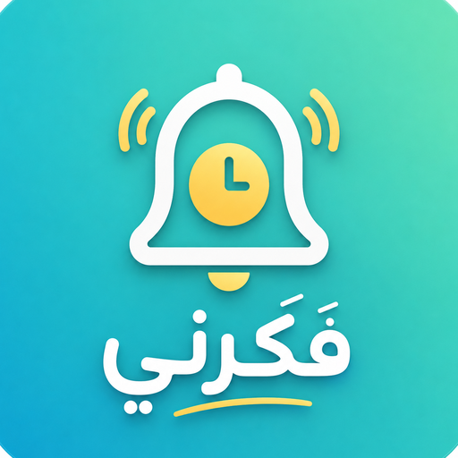

# 🔔 فَكّرني — مساعدك الشخصي لتذكر يومك

تطبيق ويب تقدمي (PWA) يعمل بالكامل من غير إنترنت وبدون أي حساب أو خادم (Backend). كل بياناتك بتفضل محفوظة على جهازك فقط.



---

## ✨ المميزات

| القسم | الوصف |
|---|---|
| 🏠 الرئيسية | لوحة تجمع أهم حاجة محتاج تعملها النهاردة في مكان واحد |
| ⏰ التذكيرات | إضافة تذكيرات بوقت محدد مع إشعارات وصوت تنبيه |
| 💊 الأدوية | تتبّع مواعيد الأدوية مع خيار "تم" أو "أجّل 10 دقايق" من الإشعار نفسه |
| 💰 الفلوس | تسجيل مصاريف/مبالغ يومية بسيطة |
| 🔁 العادات | متابعة عادات يومية مع سجل إنجاز يومي (Habit tracking) |
| 📝 الملاحظات | ملاحظات سريعة |
| 📅 التقويم | عرض شهري لكل التذكيرات والأحداث |
| ⚙️ الإعدادات | الوضع الليلي/النهاري، تغيير لون الثيم، نسخ احتياطي (تصدير/استيراد JSON) |

### تخصيص الشكل (Theming)
فيه نظام ألوان جاهز (الافتراضي، Ocean، Lavender، Forest، Sunset، Rose، Slate) أو اختيار لون مخصص بالكامل، مع حساب تلقائي لتباين الألوان (WCAG contrast) عشان الخط يفضل واضح مهما كان اللون المختار.

### الإشعارات
الإشعارات محلية بالكامل (Local Notifications) — مفيش سيرفر Push. يعني التنبيه بيشتغل طول ما التطبيق مفتوح (في الواجهة أو في الخلفية كـ tab)، وده قيد صادق وطبيعي لتطبيق شغال بدون إنترنت وبدون سيرفر خلفي.

---

## 🗂️ هيكل المشروع

```
fakkerny/
├── index.html              نقطة الدخول + كل الـ Markup
├── manifest.json            بيانات الـ PWA (اسم، أيقونات، ألوان...)
├── sw.js                    Service Worker (تخزين مؤقت للعمل أوفلاين + توجيه إشعارات)
├── css/
│   └── style.css            كل التنسيقات (تصميم فاتح/غامق + متغيرات الألوان)
├── js/
│   ├── app.js                نقطة التشغيل الرئيسية (boot, تنقل, تسجيل SW, زر التثبيت)
│   ├── config.js             بيانات ثابتة (المطور، واتساب...)
│   ├── core/
│   │   └── theme-manager.js  محرك الألوان المخصصة وحساب التباين
│   ├── storage/
│   │   └── db.js             طبقة التخزين المحلي (localStorage) بكل الأقسام
│   ├── features/
│   │   ├── render.js          رسم الشاشات المختلفة
│   │   ├── notify.js          فحص التذكيرات المستحقة + صوت + إشعار
│   │   └── feedback.js        إرسال بلاغ/اقتراح عبر واتساب
│   └── utils/
│       ├── date.js            دوال التاريخ/الوقت
│       └── parse.js           دوال تنسيق/تحليل عامة
└── icons/
    ├── icon-192.png
    ├── icon-512.png
    ├── icon-maskable-512.png
    └── apple-touch-icon.png
```

---

## 🚀 التشغيل محليًا

لازم تشغّل المشروع من خلال سيرفر محلي (مش بفتح الملف مباشرة من الجهاز)، عشان الـ Service Worker والتثبيت يشتغلوا صح:

```bash
# من داخل مجلد المشروع
python3 -m http.server 8080
# أو
npx serve .
```

بعدين افتح `http://localhost:8080` من المتصفح.

---

## 📱 النشر والتثبيت على الموبايل (مهم جدًا)

عشان زرار "تثبيت التطبيق" يظهر ويشتغل صح على الموبايل، لازم يتوفر شرطين أساسيين مش هيشتغلوا من غير سيرفر:

1. **استضافة عبر HTTPS حقيقية** (أو `localhost` وقت التطوير). المتصفحات (خصوصًا Chrome على أندرويد) **مرفوضة تسجّل الـ Service Worker ولا تعرض شاشة التثبيت لو الموقع اتفتح كملف `file://`** — يعني لو التطبيق اتبعت zip وتم فتح `index.html` مباشرة من مدير الملفات في الموبايل، التثبيت مش هيشتغل أبدًا، ده مش خطأ في الكود.
   - خيارات استضافة مجانية وسريعة: **GitHub Pages**, **Netlify**, **Vercel**, **Cloudflare Pages**.
2. **الأيقونات لازم تكون متاحة وبنفس المسارات** المذكورة في `manifest.json` (192px، 512px، والنسخة القابلة للقص Maskable 512px) — وده اتظبط دلوقتي (شوف قسم "الأيقونات" تحت).

### على أندرويد (Chrome)
بعد رفع المشروع على HTTPS، هيظهر تلقائيًا اقتراح "إضافة إلى الشاشة الرئيسية"، أو تقدر تستخدم زرار "⬇️ تثبيت التطبيق" الموجود في الشريط الجانبي.

### على آيفون (Safari)
آبل مش بتدعم شاشة التثبيت التلقائية (`beforeinstallprompt`) خالص — حتى لو الموقع PWA سليم 100%. لازم يدوي:
`مشاركة (Share) ⬆️ ← إضافة إلى الشاشة الرئيسية (Add to Home Screen)`

---

## 🎨 الأيقونات

اتظبطت الأيقونات كلها من تصميم اللوجو الجديد (جرس + ساعة بخلفية تدرّج فيروزي)، وبقت متسقة كالتالي:

| الملف | المقاس | الاستخدام |
|---|---|---|
| `icons/icon-192.png` | 192×192 | أيقونة عامة (Android, متصفحات) |
| `icons/icon-512.png` | 512×512 | أيقونة عامة عالية الدقة + شاشة splash |
| `icons/icon-maskable-512.png` | 512×512 | نسخة بها هامش أمان (Safe Zone) عشان لو النظام قصّها بشكل دائري/مربع دائري متقصش الشعار أو النص |
| `icons/apple-touch-icon.png` | 180×180 | أيقونة الشاشة الرئيسية في iOS |

> ملاحظة تقنية: بعد استبدال ملفات الأيقونات تم رفع رقم إصدار الكاش في `sw.js` (`fakkerny-v3`) عشان أي حد كان مثبّت نسخة قديمة من التطبيق ياخد الأيقونة الجديدة تلقائيًا بدل ما يفضل شايل نسخة متخزنة قديمة.

---

## 🔔 الباك إند — إشعارات تشتغل حتى لو التطبيق مقفول (اختياري)

المشروع أصلًا شغال 100% بدون سيرفر. الجزء ده إضافة **اختيارية** (Opt-in) لمين عايز الإشعارات توصله حتى لو قفل التطبيق تمامًا — مش مجرد وهو فاتح في الخلفية. اتبنى بالكامل بـ **Node.js** على شكل **Vercel Serverless Functions**، فمش محتاج استضافة تانية، هيتنشر مع نفس المشروع على فيرسل.

### إزاي شغّالة

```
المتصفح (Push API) → api/subscribe.js → Vercel KV (تخزين الاشتراك + المواعيد)
                                              ↑
                          api/sync-schedule.js (كل ما تضيف/تعدّل تذكير)
                                              ↓
                    Vercel Cron (كل دقيقة) → api/cron/check-due.js → يبعت Push حقيقي
                                              ↓
                                    sw.js (push event) → إشعار على الجهاز
```

### هيكل ملفات الباك إند

```
api/
├── subscribe.js         تسجيل جهاز جديد للإشعارات
├── unsubscribe.js        إلغاء التسجيل ومسح بياناته
├── sync-schedule.js       استقبال قائمة "المواعيد الجاية" من المتصفح
├── cron/
│   └── check-due.js       بيشتغل كل دقيقة، يبعت الإشعار المستحق فعليًا
└── lib/
    ├── push.js            إعداد web-push بمفاتيح VAPID
    └── store.js            التعامل مع Vercel KV
vercel.json                 جدول الـ Cron Job
package.json                 مكتبات الباك إند (web-push, @vercel/kv)
```

### خطوات التفعيل (مرة واحدة)

1. **ولّد مفاتيح VAPID** — دي بصمة السيرفر بتاعك عند خدمات الـ Push:
   ```bash
   npx web-push generate-vapid-keys
   ```
   هيديك `Public Key` و `Private Key`.

2. **حط الـ Public Key في الكود:**
   افتح `js/config.js` وحط القيمة في `push.vapidPublicKey`. (طول ما الحقل ده فاضي، الميزة كلها بتفضل مخفية من الإعدادات تلقائيًا.)

3. **فعّل Vercel KV:**
   من داشبورد المشروع في فيرسل → **Storage** → **Create Database** → اختار **KV** → Connect للمشروع. فيرسل بيضيف متغيرات البيئة المطلوبة (`KV_*`) تلقائيًا.

4. **ضيف باقي متغيرات البيئة:**
   من **Settings → Environment Variables** في فيرسل:
   | المتغير | القيمة |
   |---|---|
   | `VAPID_PUBLIC_KEY` | نفس الـ Public Key من خطوة 1 |
   | `VAPID_PRIVATE_KEY` | الـ Private Key من خطوة 1 (سري — متحطوش في أي ملف كود) |
   | `VAPID_SUBJECT` | `mailto:your@email.com` |
   | `CRON_SECRET` | أي نص عشوائي طويل (بيحمي endpoint الـ Cron من إن أي حد ينده عليه) |

5. **ارفع التحديث (git push)** وفيرسل هيعمل Deploy تلقائي، وهيسجّل جدول الـ Cron من `vercel.json` لوحده.

> ⚠️ **ملحوظة عن الخطة المجانية (Hobby):** فيرسل بيحدد الـ Cron على الخطة المجانية بمرة واحدة كل يوم بس (مش كل دقيقة). عشان كده `vercel.json` دلوقتي مضبوط افتراضيًا `"0 6 * * *"` (كل يوم الساعة 6 صباحًا بتوقيت UTC) عشان الـ Deploy ينجح على Hobby من غير أي تعديل. ده يعني إشعارات "بعد التطبيق مقفول" هتوصل مرة واحدة يوميًا مش لحظيًا. لو عايز دقة فعلية (كل دقيقة، يعني الإشعار يوصل قريب من ميعاده الحقيقي)، محتاج ترقية لخطة **Pro** وبعدين تغيّر `schedule` لـ `"* * * * *"`.

### الخصوصية بعد الإضافة دي
الميزة دي **مش مفعّلة افتراضيًا**. لما المستخدم يفعّلها بنفسه من الإعدادات، بيتبعت للسيرفر بس: **وقت التذكير + عنوانه** (زي "اسم الدواء" أو "عنوان التذكير"). أي بيانات تانية — تفاصيل الفلوس، الملاحظات، سجل العادات — بتفضل على الجهاز زي ما هي، متتبعتش أبدًا.

---

## 🔒 الخصوصية

مفيش أي اتصال بالإنترنت لأي بيانات شخصية. كل حاجة بتتخزن في `localStorage` على جهاز المستخدم فقط تحت مساحة اسم `fk:`. الـ Service Worker بيرفض أي طلب Cross-Origin (بيتعامل بس مع ملفات نفس الموقع).

---

## 🛠️ صنع بواسطة

**Peter Elea** — Full Stack Web Developer
- [LinkedIn](https://www.linkedin.com/in/peter-elea-71689935a/)
- [Instagram](https://www.instagram.com/beter_elea/)
